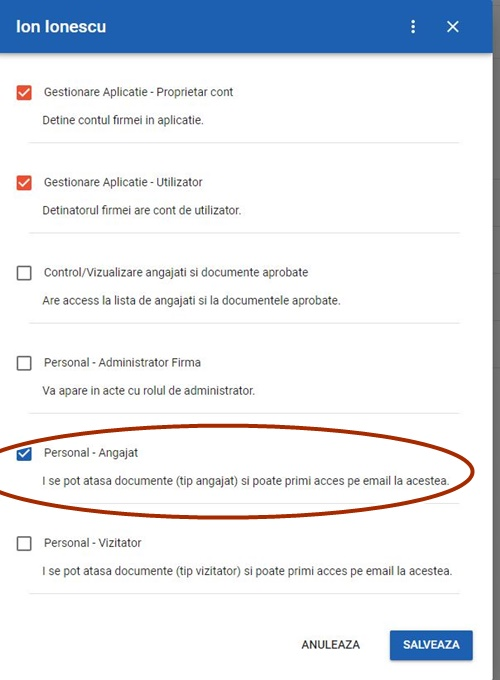

# Contul de SSM si rolurile pe care le poti avea in platforma


 Cu un singur cont poti indeplini mai multe roluri.

1.Inspector SSM, 

2.Control-Audit 

3.Personal cu 3 variante de cont: administrator firma, angajat, vizitator.


 


Fiecarei persoane i se va atribui de catre cel care va crea contul, rolul pe care se doreste sa-l aiba in aplicatie. 

Acea persoana poate avea si rol de angajat si rol de gestionare, daca se doreste acest lucru.


**Ce inseamna aceste roluri?**  Un rol este o interfata. 

     1.Inspector SSM

     2.Control-Audit

     3.Personal \(administrator firma, angajat, vizitator\)

**Exemplu**: 

Ion Popescu si-a creat un cont pe platforma SSM.ro la invitatia firmei la care lucreaza, pentru a se putea instrui online. 

Acesta este contul Personal cu rol de angajat intr-o firma. 

Cu acest cont, el se va putea instrui, va putea semna actele pe care i le va trimite firma/Inspectorul SSM, sa le citeasca, semneze, etc. 

Cu acest rol, cel de angajat, va avea acces doar la documentele sale,  trimise de catre firma/Inspectorul SSM.

 Nu va putea modifica, sterge sau incarca alte acte. Va putea doar sa vada ce acte ii sunt alocate, ce acte are de semnat, care sunt aprobate si care in asteptare.

In contul tau poti avea mai multe firme si in fiecare din ele poti indeplini roluri diferite.

Alege rolul pe care-l ai si vezi documentatia.

**Descriere roluri:**

**Gestionarea aplicatiei** inseamna ****ca ai cont de Inspector SSM si ai acces la tot panoul platformei, la toate actele, documentele, fisele din firma sau firmele pe care le vei coordona pe domeniul SSM.


Firma poate permite si altor persoane sa aiba rol de gestionare/cont Inspector.


Cu acest cont ai acces la intreaga ducumentatie introdusa in platforma si poati aduce orice modificari asupra documentatiei din contul firmei respective.

**Documente mele.**  Este valabil pentru contul Personal cu cele 3 variante de cont: administrator firma, angajat, vizitator.

 Cu acest rol nu poti incarca fisiere sau alte acte, nu poti accesa alte documente, decat cele pe care ti le-a trimis firma, nu poti sterge sau modifica actele.

**Vizualizare angajati/documente.**  Pot fi persoanele cu rol Control-Audit si pot astfel vizualiza actele aprobate dinr-o firma, fara a aduce vreo modificare asupra actelor din cont.

