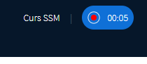

# 13.Conferinte live

**a\). Ce este o conferinta live?**

Platforma ssm.ro asigura partenerilor sai suport online prin organizarea de evenimente/intalniri live de catre Inspectorii SSM, pentru facilitarea proceselor ce tin de acest domeniu si pastrarea interactiunii cu persoanele participante.

 Utilizatorii vor  avea acces la o conferinta, in baza unei invitații transmisa de organizator pe email.

Platforma poate fi accesata, de pe orice dispozitiv:

* Computer
* Laptop
* Tabletă
* Smartphone

**b\). Cum organizez o conferinta live?**

 **Pasul 1.** Din contul tau, cauta pe panoul din stanga, categoria de "Conferinte" 

 **Pasul 2**. Adauga o conferinta si da-i un titlu.

**Pasul 3.** Adauga pe rand, participanti din contactele existente in listele tale si apasa INVITA.


Daca una din persoanele invitate, va fi moderator, bifeaza casuta pentru confirmare.


Contactele tale/participantii la conferinta sunt notificati prin email si trebuie sa accepte invitatia ta.


Poti de asemenea, sa adaugi si alte persoane, pe baza trimiterii unor invitatii pe email.


**Pasul 4.** Apasa INTRA pentru conferinta live.

**Pasul 5.** Esti in conferinta live.

Pe stanga panoului vezi cine participa la conferinta si poti comunica si cu ajutorului chat-ului disponibil  in partea de jos a ecranului.


Casuta patrata din dreptul unui invitat, sugereaza ca este moderator si poate scoate din conferinta un alt invitat, daca se doreste acest lucru,  poate de asemenea, sa opreasca  microfonul unuia din invitati si poate avea prezentatori din grupul de invitati care sa prezinte diverse informatii pentru restul participantilor.


**Pasul 6**. Persoanele care doresc sa vorbeasca, vor trebui sa apese pe imaginea microfonului, iar cei care doresc doar sa asculte, vor apasa imaginea cu casti. 

Poti participa ca si invitat, ascultand conferinta si cand doresti sa vorbesti, apesi imaginea cu microfonul, iar apoi poti reveni la ascultare, dupa ce ai terminat ce aveai de spus, apasand imaginea cu castile.

                                              In imaginea de mai jos, microfonul este activat

\*\*\*\*

                                                              Aici avem un microfonul dezactivat

\*\*\*\*

                                                          Aici nu avem nici audio, nici acces camera

\*\*\*\*

**Pasul 7**. Daca in timpul conferintei, vei fi invitat de catre moderator sa tii un discurs, ca si prezentator, asigura-te ca microfonul e functional si instalat in mod corect, iar sunetul e cat se poate de clar pentru a putea fi auzit fara intreruperi sau zgomote de fond.

 Dupa ce termini de prezentat partea ta in conferinta respectiva si doresti doar sa asculti restul prezentarii, dezactiveaza microfonul si ramai pe ascultare, apasand imaginea cu castile.

**Pasul 8**. Un pas important, in conferinte live il reprezinta camera web. Asigura-te ca este instalata corespunzator.

Pentru a putea intra in conferinta live cu camera, apasa pe imaginea camerei pentru a permite invitatilor sa te poata vedea.

**Pasul 9**. Pentru a permite invitatilor sa vada o prezentare care va rula pe ecranul calculatorului lor, apasa imaginea cu ecran si incarca din calculatorul tau, ce fisier doresti sa ruleze. Poate fi o prezentare powerpoint,  documente word, poze, filme de pe youtube.

**Pasul 10**. Pentru prezentarile pe intreg ecranul afisat, in dreapta sus, apasati cele 3 puncte si veti avea posibilitatea sa alegeti aceasta varianta.

**Pasul 11**. Pentru deconectarea din conferinta, mergi din nou la cele 3 puncte, din dreapta sus a ecranului si alege Deconectare:

**Cum pot inregistra o conferinta?**

**Pasul 1.** Alege categoria **Conferinte** din meniul aflat pe partea stanga a contului tau.

**Pasul 2**. Apasa butonul **ADAUGA CONFERINTA**. 

Denumeste conferinta dupa cum o doresti si poti sa scrii si ceva informatii la descriere.

Adauga maximul de participanti.

**Bifeaza daca se doreste inregistrarea.**  Apasa butonul **SALVEAZA.**

\*\*\*\*

**Pasul 3.** Pe mijlocul ecranului, in partea de sus vei avea imaginea de mai jos.

     **Pasul 4**. Apasa pe butonul **Porneste inregistrarea**, pentru a inregistra. Daca vei apasa din nou, aceasta se va opri. 

Se pot face selectii de cadre, din prezentari, cu ce anume doresti sa inregistrezi, daca nu se doreste ca intreaga conferinta sa fie inregistrata, ci doar fragmente din ea, sau o poti inregistra integral.

Imaginea de mai jos arata ca se inregistreaza.


Odata ce ai bifat ca doresti inregistrarea conferintei, dar ai uitat sa apesi pe butonul  PORNESTE INREGISTAREA, aceasta se va inregistra oricum si va fi arhivata pe serverul platformei SSM, timp de 14zile. 


