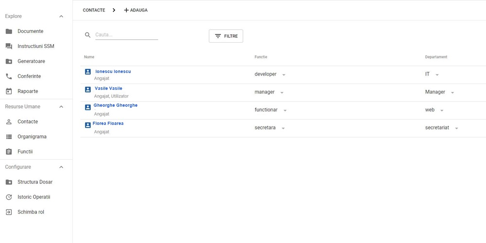
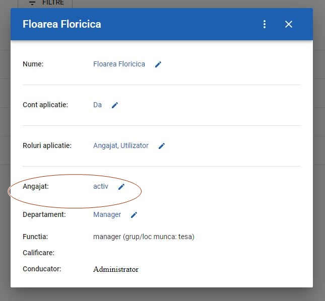

# 9.Contacte

7.a\) Aceasta categorie iti va pune la dispozitie toate contactele pe care le-ai introdus fie manual in sistem, fie prin lista cu angajati, necesara pentru compararea cu raportul Revisal.

7.b\) Cu ajutorul filtrelor, vei putea sorta in functie de: departament, functie,  dupa nume sau prenume, usurandu-ti cautarile din multe contacte pe care le vei avea.

7.c\). Deasemenea, poti face editari ale fiecarui contact/angajat, apasand direct pe numele acestuia si poti completa sau modifica datele acestuia rpin simpla apasare a creionul albastru de pe ecran. Acolo unde nu exista creionul nu se pot aduce modificari.

7.d\) Daca doresti sa stergi un contact, apasa cele 3 puncte aflate in dreapta sus a imaginii si se va deschide un patrat cu cele 3 variante de optiuni: poti vedea rapid ce documente are alocate acest angajat, ce documente are lipsa si sa-l stergi definitiv din contacte si automat din aplicatie si din firma din care facea parte.

## Rolul angajatului in aplicatie. Editarea contactelor/angajatilor.

Plecand de la imaginea de mai jos, putem edita fiecare categorie care are semnalizata creionul albastru.

*  **Nume**: putem edita atat numele cat si datele personale, CNP, nr de telefon, adresa, emailul.

\*\*\*\*

* **Cont aplicatie**: Conectarea la aplicatie a anagajatului va fi valida, atat timp cat administratorul va considera necesara prezenta acestuia in firma. Daca anagajatul va fi demis, concediat sau nu mai face parte din firma respectiva, contactul va fi sters si accesul interzis la actele ce tin ce firma din care a facut parte.


Angajatul isi pastreaza contul cu care s-a inregistrat in aplicatie, dar nu va mai avea acces la firma si actele firmei din care a facut parte, daca acest lucru ii va fi restrictionat din diverse motive.


* **Roluri aplicatie**: Se poate edita rolul pe care doresti sa-l aiba in aplicatie, respectivul angajat.

Poate fi doar personal-angajat, poate fi personal-administrator sau vizitator.

* **Stare-angajat.** Reprezinta starea angajatului din cadrul firmei, la momentul introducerii sale in sistem: este activ, este suspendat sau incheiat.

Si urmatoarele 4 categorii, vor fi editate conform cerintelor:

* **Departamentul** din care face parte angajatul.
* **Functia** din cadrul firmei respective
* **Calificarea** pe care o are angajatul
* **Conducatorul**. Vei trece persoana care conduce departamentul din care angajatul face parte.

